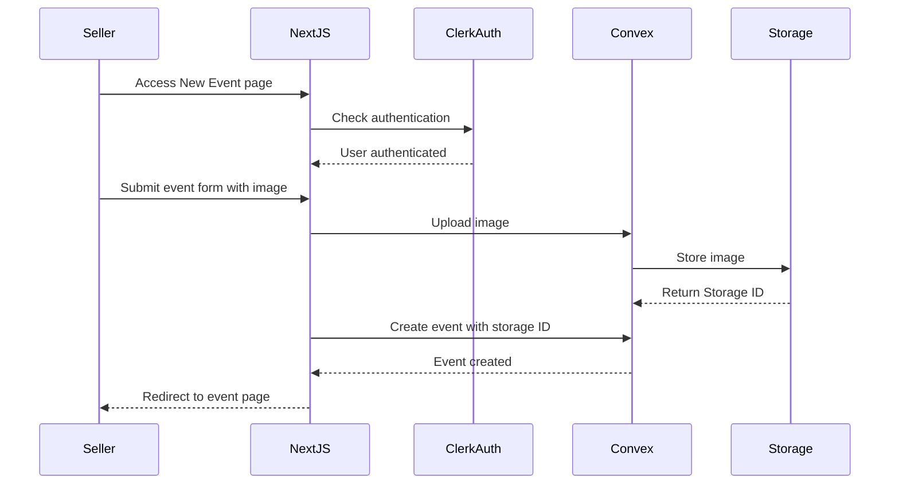
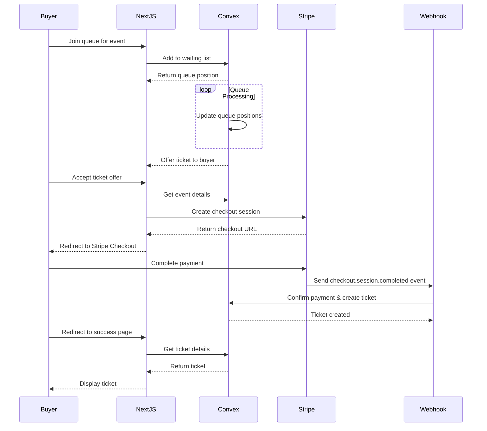
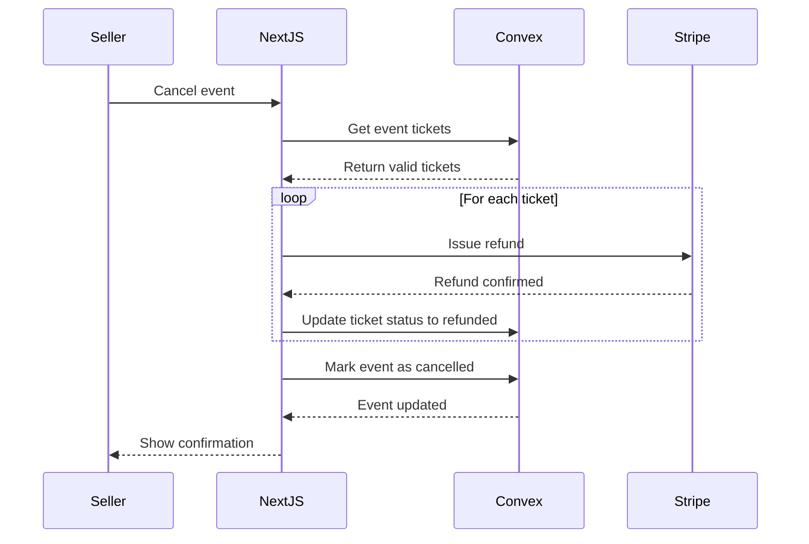
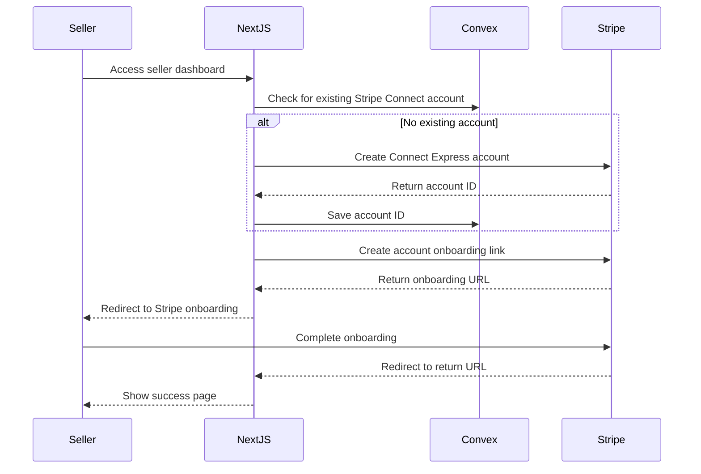

# Ticketing Marketplace SaaS App - Architecture & System Design

## System Overview

The Ticketing Marketplace SaaS application is a feature-rich platform for event ticketing, built with Next.js 15. It enables event organizers to create and manage events, sell tickets with secure payment processing, and provides buyers with a queue system for fair access to high-demand events.

## Core Architecture

### Tech Stack

| Component | Technology | Purpose |
|-----------|------------|---------|
| Frontend | Next.js 15, Shadcn UI, Tailwind CSS | Responsive user interface with server and client components |
| Backend | Convex | Real-time database and API layer |
| Authentication | Clerk | User authentication with MFA support |
| Payments | Stripe Connect | Payment processing and marketplace transactions |
| Storage | Convex Storage | Image storage for event assets |
| Deployment | Netlify | Production hosting and CI/CD |
| Language | TypeScript | Type-safe development |

### System Architecture Diagram

```
┌─────────────────────────────────────────────────────────────────┐
│                        Client Browser                           │
└───────────────────────────────┬─────────────────────────────────┘
                                │
                                ▼
┌─────────────────────────────────────────────────────────────────┐
│                      Next.js Application                        │
│  ┌───────────────┐   ┌───────────────┐   ┌───────────────────┐  │
│  │  Client-side  │   │  Server-side  │   │  Server Actions   │  │
│  │  Components   │   │  Components   │   │                   │  │
│  └───────┬───────┘   └───────┬───────┘   └─────────┬─────────┘  │
└──────────┼───────────────────┼───────────────────┬─┼────────────┘
           │                   │                   │ │
           ▼                   ▼                   │ │
┌──────────────────┐  ┌────────────────┐          │ │
│   Clerk Auth     │  │  Convex API    │◄─────────┘ │
└──────────────────┘  └────────┬───────┘            │
                               │                    │
                               ▼                    │
                      ┌────────────────┐            │
                      │ Convex Storage │            │
                      └────────────────┘            │
                                                    ▼
                                           ┌────────────────┐
                                           │  Stripe API    │
                                           └────────────────┘
```

## Key Subsystems

### 1. User Authentication & Authorization

- **Implementation**: Clerk for authentication
- **Features**:
  - Multi-factor authentication
  - Role-based access control (buyers vs. sellers)
  - Secure session management
- **Flow**:
  - Authentication state managed via Clerk's React hooks (`useUser`, `SignInButton`)
  - Middleware protection for secured routes

### 2. Event Management System

- **Implementation**: Convex database with TypeScript API
- **Features**:
  - Event creation, updating, and cancellation
  - Image upload for event listings
  - Managing ticket availability
  - Searching and filtering events

### 3. Real-Time Queue System

- **Implementation**: Convex database with real-time capabilities
- **Features**:
  - Fair ticket distribution for high-demand events
  - Rate limiting to control queue access
  - Real-time position updates
  - Time-limited ticket offers
- **Flow**:
  1. User joins queue for an event
  2. System assigns queue position
  3. When user's turn arrives, ticket is offered for limited time
  4. User must complete purchase within the offer window

### 4. Payment Processing

- **Implementation**: Stripe Connect integration
- **Features**:
  - Multi-party payments (platform fee + seller payout)
  - Secure checkout process
  - Refund handling for cancelled events
- **Flow**:
  1. Seller connects Stripe account
  2. Buyer purchases ticket through Stripe Checkout
  3. Platform takes small fee (1%)
  4. Remainder is transferred to seller's account
  5. Webhook confirms successful payment

### 5. Seller Dashboard

- **Implementation**: Protected Next.js routes with Convex API
- **Features**:
  - Event management (CRUD operations)
  - Sales tracking
  - Payout management via Stripe Connect
  - Event cancellation with automatic refunds

## Data Models

### 1. Users

```typescript
interface User {
  _id: Id<"users">;
  userId: string;  // Clerk user ID
  stripeConnectId?: string;  // For sellers
  createdAt: number;
}
```

### 2. Events

```typescript
interface Event {
  _id: Id<"events">;
  userId: string;  // Creator's Clerk ID
  name: string;
  description: string;
  location: string;
  eventDate: number;  // Unix timestamp
  imageStorageId?: Id<"_storage">;
  price: number;
  totalTickets: number;
  is_cancelled: boolean;
  createdAt: number;
}
```

### 3. Waiting List

```typescript
interface WaitingList {
  _id: Id<"waitingList">;
  eventId: Id<"events">;
  userId: string;
  status: "waiting" | "offered" | "expired" | "purchased";
  position: number;
  joinedAt: number;
  offerStartedAt?: number;
  offerExpiresAt?: number;
}
```

### 4. Tickets

```typescript
interface Ticket {
  _id: Id<"tickets">;
  eventId: Id<"events">;
  userId: string;
  waitingListId: Id<"waitingList">;
  status: "valid" | "used" | "refunded" | "expired";
  paymentIntentId: string;
  amount: number;
  purchasedAt: number;
  event?: Event;  // Denormalized data for queries
}
```

## Key Workflows

### 1. Event Creation Process



### 2. Ticket Purchase Flow



### 3. Event Cancellation & Refund Process



### 4. Seller Onboarding with Stripe Connect



## API Structure

### Server Actions (Next.js)

1. **Stripe Integration**
   - `createStripeCheckoutSession`: Creates checkout session for ticket purchase
   - `createStripeConnectAccountLink`: Creates onboarding link for sellers
   - `createStripeConnectCustomer`: Creates Stripe Connect account for sellers
   - `getStripeConnectAccountStatus`: Checks seller's Stripe account status
   - `refundEventTickets`: Processes refunds for cancelled events

2. **Webhooks**
   - `/api/webhooks/stripe`: Handles Stripe checkout completion events

### Convex API

1. **Events API**
   - `events.create`: Create new event
   - `events.getById`: Get event by ID
   - `events.search`: Search events
   - `events.getEventAvailability`: Check ticket availability
   - `events.getUserTickets`: Get user's tickets
   - `events.cancelEvent`: Cancel event
   - `events.purchaseTicket`: Create ticket after payment

2. **Users API**
   - `users.getUsersStripeConnectId`: Get seller's Stripe Connect ID
   - `users.updateOrCreateUserStripeConnectId`: Save Stripe Connect ID

3. **Waiting List API**
   - `waitingList.join`: Add user to queue
   - `waitingList.getQueuePosition`: Get user's position
   - `waitingList.offerTicket`: Offer ticket to user
   - `waitingList.processQueue`: Update queue positions

4. **Tickets API**
   - `tickets.getTicketWithDetails`: Get ticket with event details
   - `tickets.getValidTicketsForEvent`: Get valid tickets for an event
   - `tickets.updateTicketStatus`: Update ticket status

## Security Considerations

1. **Authentication**
   - Clerk handles authentication security
   - Protected routes with middleware

2. **Payment Security**
   - Stripe handles payment information
   - No storage of payment details on server

3. **Rate Limiting**
   - Queue system prevents ticket scalping
   - Controls access to high-demand events

4. **Data Validation**
   - TypeScript for type safety
   - Server-side validation of all requests

## Scalability Considerations

1. **Database Scaling**
   - Convex handles database scaling
   - Real-time capabilities without custom infrastructure

2. **Frontend Performance**
   - Next.js app router for efficient page loads
   - Client-side components for interactive elements
   - Server components for data-heavy operations

3. **Queue Management**
   - Distributed system for queue position updates
   - Timed offers to prevent queue stalling

## Deployment Architecture

1. **Netlify Deployment**
   - Automatic CI/CD pipeline
   - Environment variable management
   - Edge functions for global availability

2. **Services Configuration**
   - Clerk authentication integration
   - Convex backend configuration
   - Stripe webhook setup

## Future Expansion Possibilities

1. **Additional Features**
   - Mobile app with ticket scanning
   - Event analytics dashboard
   - Affiliate marketing system
   - Season passes and subscription models

2. **Integration Opportunities**
   - Calendar integration (Google, Apple)
   - Social media sharing
   - Email marketing automation
   - Virtual event hosting
